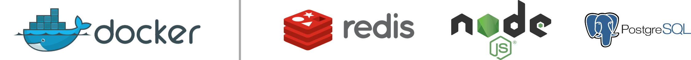

# TypeScript Docker Rest API Boilerplate

  <strong>Runs on</strong>
   
   
  

## Running

### Requirements

To run Docker API Boilerplate in your machine, you must have installed:

- [Docker](https://www.docker.com/)
- [Node.JS 12+](https://nodejs.org/en/)
- [Yarn](https://yarnpkg.com/)

### Steps to run

For any environment: copy `.env.example` to `.env.[environment]`, where `[environment]` is one of: `dev`, `prod`, `test`.

#### Run for development

Make sure you setup `.env.dev`.

Run `yarn` to install dependencies.

Run `yarn docker:dev` to run the server and databases.

#### Run for tests

Make sure you setup `.env.test`.

Run `yarn` to install dependencies.

Run `yarn test` to run the tests.
